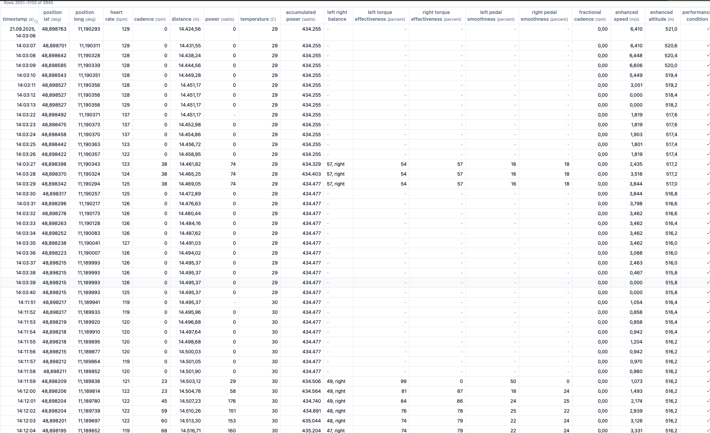

Test file with break:

See at https://intervals.icu/activities/i98293162
https://www.strava.com/activities/15887635500/analysis

## Make strava response and catch strems

117429 record number

11:11:46

51:54

3114 sekunden

12:03:40 nach 

We need to change the records design completely.
For every session there should be only one record with the data as array.
lap_id can be deleted.
timestamp will just be time after start_time in seconds.
The rest of the columns can stay the same in my opinion but as array.
The cange needs to be done because in the frontend it is impossible to handle so many rows.
There need to be changes in the migrations you can change the migration directly since i will reset the database.
Also in the backend for fit file parsing and strava response parsing the changes need to be done.
Also the functions calculating the heart rate load need to be adjusted.
And in the frontend espacially in the activity detail view the changes required need to be done.
And also check if anywhere else in the code the records are used and need to be adjusted.